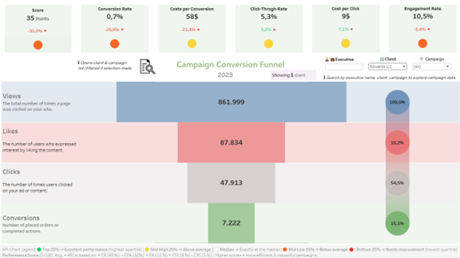
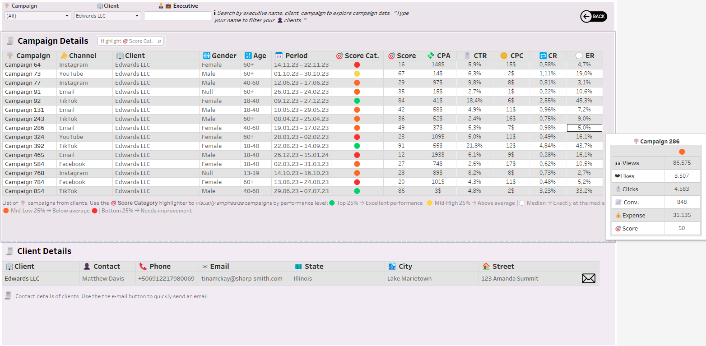

# 🎯 Marketing KPI Analysis and Model Interpretation with SHAP

A data analytics project for evaluating campaign performance using Python, SHAP and Tableau.

---

## 📌 Project Overview

**Author:** Sefer Adiyaman  
**Project period:** July 8 – July 22, 2025  
**Tools used:** Python (`pandas`, `matplotlib`, `shap`), Excel, Tableau, Jupyter Notebook

This project focuses on evaluating marketing campaign performance using modern data analysis techniques. The approach combines predictive modeling, SHAP-based model interpretation, and effective data visualization to support evidence-based decisions.

### Main Objectives:
1. **Construction of a data-driven, synthetic Performance Score**  
   → A unified score that combines multiple KPIs (e.g., CTR, CR, CPA) into a single, interpretable metric scaled from 0 to 100 using SHAP-based feature weighting.

2. **Development of a user-friendly dashboard for supporting campaign management decisions**  
   → An interactive Tableau dashboard that visualizes campaign scores, KPI breakdowns, and percentile rankings to help executives quickly identify strengths and weaknesses.

---

<pre> ## 📁 Repository Structure KPI_Analysis_Random_Forest_SHAP/ │ ├── 📂 data/ # Raw & cleaned CSV/Excel files ├── 📂 notebooks/ # Python notebooks for analysis and modeling ├── 📂 output/ # Exported score files and plots ├── 📂 report/ # Final written report (PDF, DOCX etc.) ├── 📂 dashboard/ # Tableau screenshots and dashboard thumbnails └── README.md # Project overview and documentation </pre>

---

## 📊 Executive Dashboard (Tableau Public)

🔗 **Live link:**  
👉 [Campaign Conversion Funnel – Executive Dashboard](https://public.tableau.com/app/profile/sefer.adiyaman/viz/Campaign_Conversion_Funnel_Executive_Dashboard/DashboardFUNNEL)

### 🔍 Dashboard Preview

<table>
  <tr>
    <td></td>
    <td></td>
  </tr>
</table>

---

## 📎 License

This repository is published for educational and portfolio purposes only.  
All brand names and campaigns are anonymized and synthetic.

---

